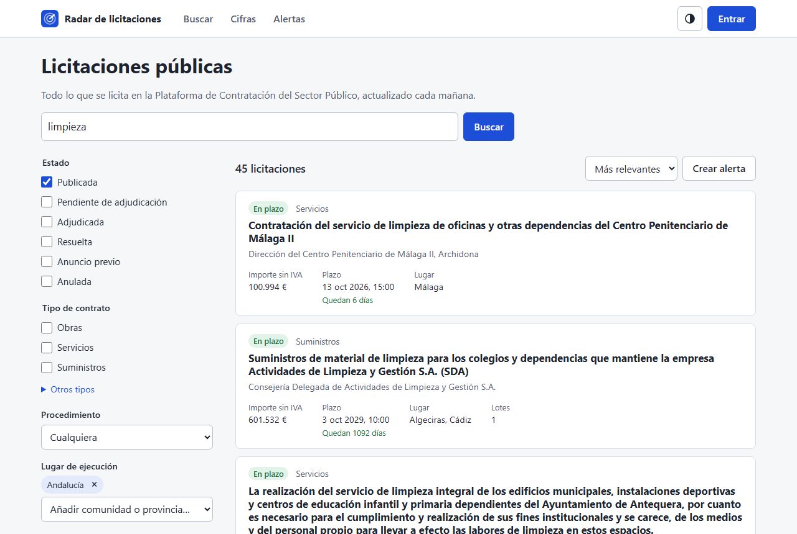
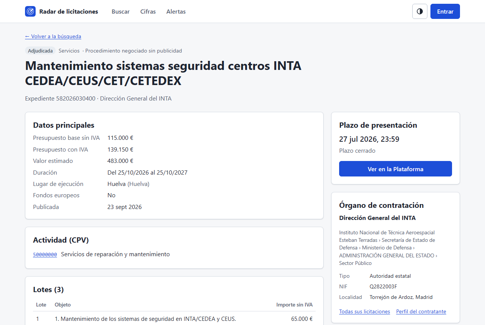
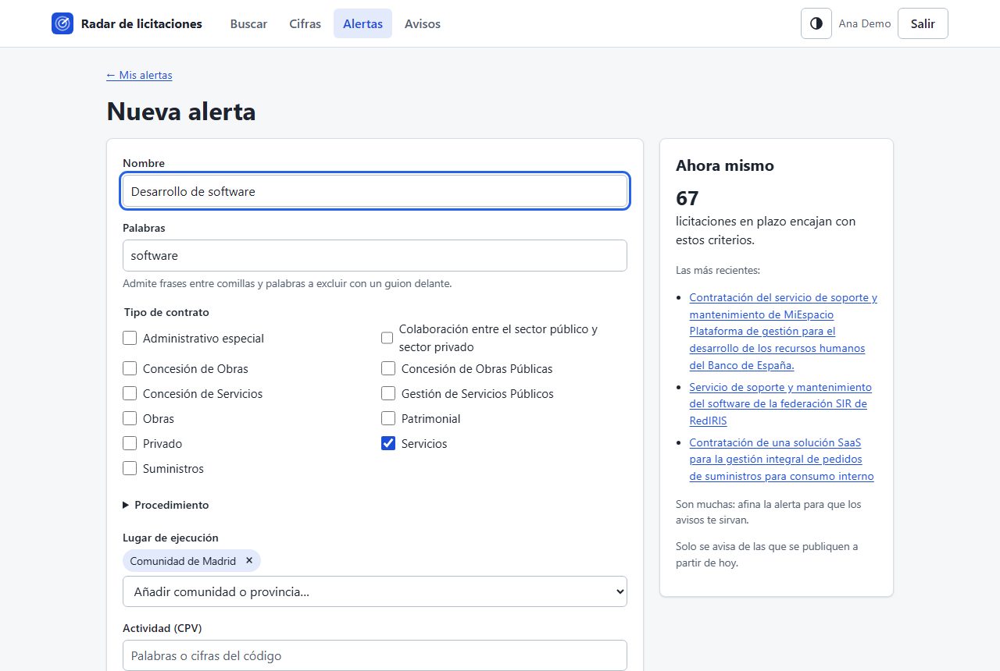
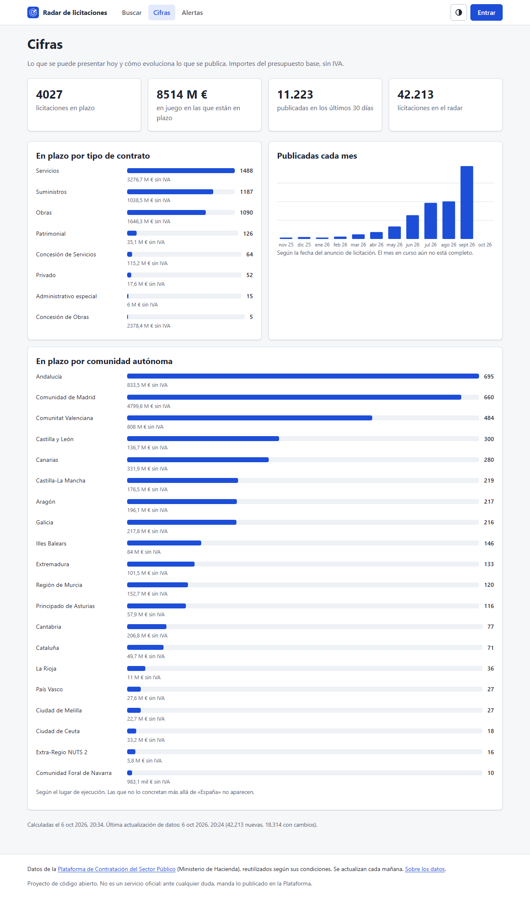
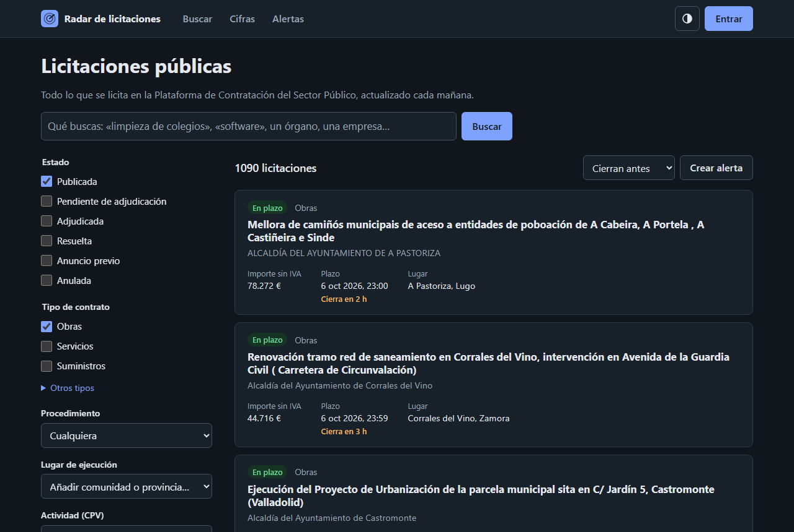
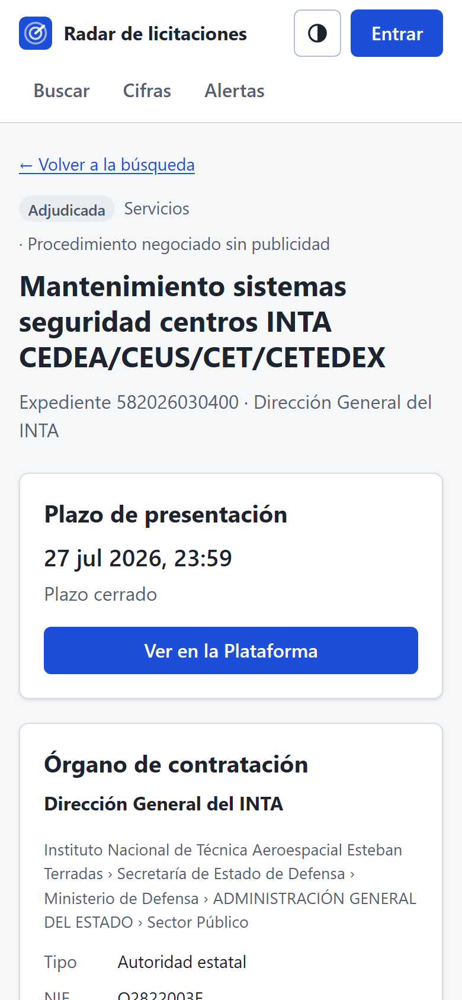
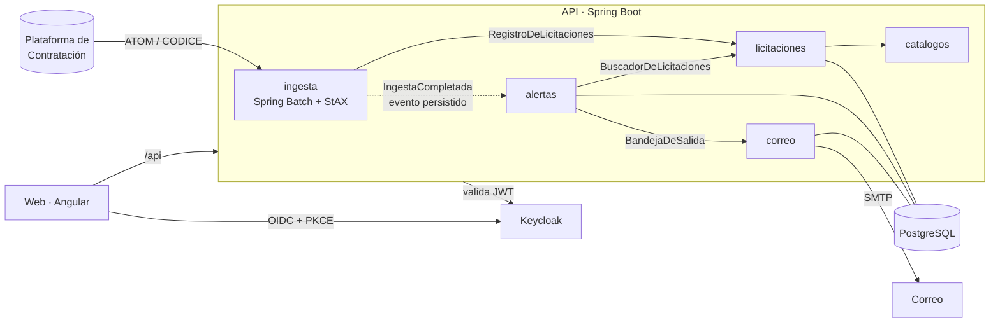

# Radar de licitaciones

[](https://github.com/marnau74/radar-licitaciones/actions/workflows/ci.yml)
[](https://github.com/marnau74/radar-licitaciones/actions/workflows/codeql.yml)
[](LICENSE)

Buscador de licitaciones públicas con alertas por correo. Carga cada mañana lo que se publica en la
[Plataforma de Contratación del Sector Público](https://contrataciondelsectorpublico.gob.es) y lo organiza
para buscarlo bien. Por texto en español (sin importar tildes), tipo de contrato, procedimiento, lugar, actividad
(CPV), importe y plazo. A cada usuario le avisa de las licitaciones nuevas que encajan con sus búsquedas guardadas.

**Java 25 · Spring Boot 4 · Spring Batch · Spring Modulith · PostgreSQL 17 · Keycloak · Angular 22**



| Ficha de una licitación | Alerta con vista previa |
|---|---|
|  |  |

| Cifras | Tema oscuro | Móvil |
|---|---|---|
|  |  |  |

Las capturas son de datos reales: el mes de septiembre de 2026 completo.

## Qué hace

- **Ingesta diaria** del feed ATOM de la Plataforma (estándar CODICE) con Spring Batch. Se lee en streaming, se
  queda siempre con la versión más reciente de cada licitación y marca las anuladas. Una ingesta de un paquete
  histórico que se corta sigue donde se quedó.
- **Búsqueda** de texto completo en español con PostgreSQL: «polizas» encuentra «pólizas», «seguro» encuentra
  «seguros». Pesa más el título que el órgano, y este más que los lotes. Filtros por estado, tipo, procedimiento,
  comunidad o provincia, CPV (a cualquier nivel: «72» son todos los servicios de TI), importe, plazo, órgano y
  fondos europeos. Todo el estado de la búsqueda va en la URL.
- **Ficha** de cada licitación: presupuesto, lotes, resultado y adjudicatarias, documentos y órgano de
  contratación con su jerarquía.
- **Alertas**: búsquedas guardadas, con vista previa de cuántas licitaciones encajan ahora. Tras cada ingesta, lo
  nuevo en plazo se convierte en avisos (en la web) y en un correo resumen por usuario. Nunca se avisa dos veces de
  lo mismo.
- **Cifras**: lo que está en plazo por tipo y por comunidad, y lo publicado cada mes.
- **API pública** documentada con OpenAPI en `/api/docs`.

## Con datos reales

Carga del paquete de septiembre de 2026 (193 ficheros, 2,9 GB de XML), en un portátil, con PostgreSQL en Docker:

| | |
|---|--:|
| Entradas leídas | 96.128 |
| Licitaciones distintas | 42.213 |
| Versiones más nuevas que la guardada | 18.314 |
| Versiones repetidas o anteriores (descartadas) | 35.383 |
| Anulaciones | 218 |
| Entradas que no se pudieron interpretar | 0 |
| Tiempo total | 72 s (unas 1.300 entradas por segundo) |

Con esos datos, la búsqueda responde en 25 a 100 ms y las cifras en unos 100 ms. Todos los códigos de tipo,
procedimiento, estado y resultado de las 42.213 licitaciones están en los catálogos oficiales. Los únicos NUTS
desconocidos son lugares de ejecución fuera de España (16 en el mes).

## Arquitectura

Un monolito modular: cada paquete de primer nivel es un módulo con su interfaz pública. Spring Modulith comprueba
en un test que ningún módulo usa las clases internas de otro y que no hay ciclos.



| Módulo | Qué hace |
|---|---|
| `ingesta` | Job de Spring Batch: fuentes (feed vivo, paquete ZIP, fichero), lector CODICE en streaming, marca del feed, ingesta diaria programada |
| `licitaciones` | Guardado por lotes con SQL (upsert por versión), búsqueda, ficha y cifras |
| `catalogos` | Listas de códigos oficiales de CODICE (CPV, NUTS, tipos, procedimientos…) en memoria |
| `alertas` | Búsquedas guardadas (JPA), avisos tras cada ingesta y composición del correo resumen |
| `correo` | Bandeja de salida en base de datos y envío con reintentos |
| `seguridad` | Resource server de Keycloak: qué es público, qué necesita sesión y qué es de administración |

Las decisiones, con sus alternativas y consecuencias, están en [docs/adr](docs/adr):

1. [Monolito modular con Spring Modulith](docs/adr/0001-monolito-modular.md)
2. [Ingesta con Spring Batch y StAX](docs/adr/0002-ingesta-por-lotes.md)
3. [Modelo y búsqueda en PostgreSQL](docs/adr/0003-modelo-y-busqueda.md)
4. [Seguridad con Keycloak y un solo origen](docs/adr/0004-seguridad.md)
5. [Avisos fiables: evento persistido y bandeja de salida](docs/adr/0005-avisos-fiables.md)

## Ponerlo en marcha en local

Hace falta Docker, JDK 25 y Node 24.15 o posterior.

```bash
docker compose up -d
```

PostgreSQL, Keycloak (con el realm y dos cuentas de ejemplo) y Mailpit, para ver los correos en
<http://localhost:8025>.

```bash
cd backend && ./mvnw spring-boot:run
```

La API, en <http://localhost:8080> (documentación en `/api/docs`). Para tener datos sin esperar a la ingesta
diaria, se puede arrancar con la página de muestra:

```bash
cd backend && ./mvnw spring-boot:run -Dspring-boot.run.arguments=--radar.ingesta.fichero-inicial=src/test/resources/codice/muestra.atom
```

Para la web, en <http://localhost:4200>:

```bash
cd frontend && npm ci && npm start
```

Cuentas de ejemplo de Keycloak (ficticias, solo para desarrollo):

- `ana@demo.example`: usuaria normal.
- `admin@demo.example`: administradora; puede lanzar ingestas desde «Los datos».

Las dos usan la contraseña `radar-demo-2026`.

Un mes histórico completo se carga entrando como administradora, en «Los datos», con el periodo (`202609`).

## Pruebas

| | Qué cubre | Cómo |
|---|---|---|
| Backend: 58 pruebas | Lector CODICE con una página real del feed, upsert por versión, anulaciones, búsqueda y filtros por la API, job de Spring Batch completo con avisos y correo (que llega a Mailpit), seguridad con tokens reales de Keycloak, límites entre módulos | `cd backend && ./mvnw verify` (Testcontainers: PostgreSQL, Keycloak y Mailpit reales; cobertura con JaCoCo, 85 % de líneas) |
| Frontend: 29 pruebas | Filtro y URL, formatos, interceptor del token, búsqueda, formulario de alertas, tarjeta de resultado | `cd frontend && npm test` (Vitest) |
| De punta a punta: 6 pruebas | La aplicación completa como en producción (imágenes, Caddy, Keycloak): búsqueda, ficha, filtros, cifras, inicio de sesión y alertas, con comprobación de accesibilidad (axe, WCAG 2.1 AA) | `docker compose -f compose.e2e.yaml up -d --build --wait` y `cd frontend && npx playwright test` |

La CI pasa todo eso en cada cambio, además de Spotless, ESLint, Prettier, `npm audit`, CodeQL (Java y
TypeScript) y una comprobación de que no hay rutas locales ni correos personales en el repositorio.

## La API

Es pública salvo las alertas, los avisos y la administración. Algunos ejemplos:

```bash
# Servicios de TI en Cataluña con el plazo abierto, de mayor a menor importe
curl 'http://localhost:8080/api/v1/licitaciones?cpv=72&nuts=ES51&abiertas=true&orden=importe'

# Ficha completa
curl http://localhost:8080/api/v1/licitaciones/20573123

# Códigos CPV por palabras
curl 'http://localhost:8080/api/v1/catalogos/cpv?q=limpieza'
```

Los errores siguen el RFC 9457 (`application/problem+json`), con los campos no válidos en `errores`.

## Despliegue

Las imágenes de la API y de la web se publican en GitHub Container Registry con cada versión, solo si pasa la CI.
En el servidor, un compose con Caddy pone la web, la API y Keycloak bajo un mismo dominio con HTTPS automático.
Paso a paso en [docs/despliegue.md](docs/despliegue.md).

## Los datos

Conjunto de datos abiertos «Licitaciones publicadas en la Plataforma de Contratación del Sector Público» del
Ministerio de Hacienda, sin los contratos menores. Se reutilizan citando la fuente, como hace la web en cada
página. Las licitaciones de las comunidades autónomas con plataforma propia se publican en otro conjunto (el de
plataformas agregadas), que este proyecto todavía no carga. No es un servicio oficial: lo que vale es lo
publicado en la Plataforma.

## Licencia

[MIT](LICENSE).
